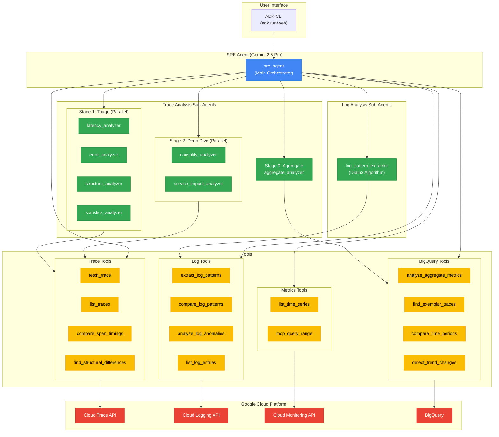
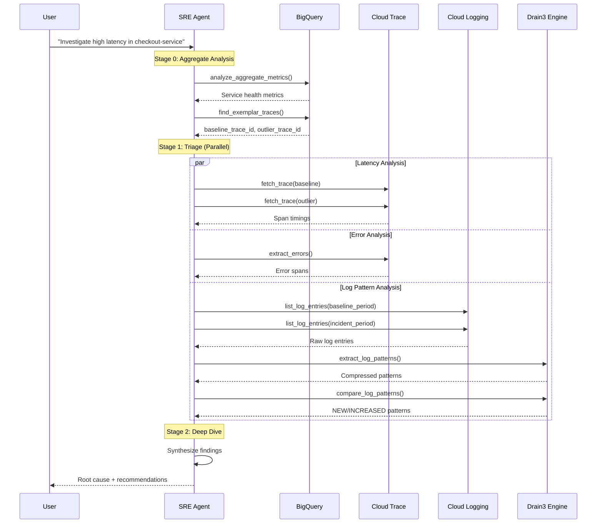

# SRE Agent

## Agent Rules
- **Keep Docs Up To Date**: When you make changes to the codebase, you MUST update `README.md` and `AGENTS.md` to reflect those changes. This is a strict rule.
- **Reference AGENTS.md**: Use this file as the source of truth for developer workflows.

## System Architecture

## Architecture Overview

The SRE Agent uses a **multi-stage analysis pipeline** with specialized sub-agents:

### Trace Analysis Pipeline

1. **Stage 0 (Aggregate)**: BigQuery-powered analysis using `aggregate_analyzer` sub-agent
   - Tools: `analyze_aggregate_metrics`, `find_exemplar_traces`, `compare_time_periods`, `detect_trend_changes`, `correlate_logs_with_trace`
   - Purpose: Start broad - analyze thousands of traces to identify patterns

2. **Stage 1 (Triage)**: Parallel trace comparison using 4 sub-agents
   - Agents: `latency_analyzer`, `error_analyzer`, `structure_analyzer`, `statistics_analyzer`
   - Purpose: Compare specific traces to identify WHAT is different

3. **Stage 2 (Deep Dive)**: Root cause analysis using 2 sub-agents
   - Agents: `causality_analyzer`, `service_impact_analyzer`
   - Purpose: Determine WHY differences occurred and assess blast radius

### Log Analysis Pipeline

- **log_pattern_extractor**: Uses Drain3 algorithm for log template extraction
  - Tools: `extract_log_patterns`, `compare_log_patterns`, `analyze_log_anomalies`
  - Purpose: Compress repetitive logs into patterns, detect anomalies by comparing time periods

## Data Flow

## Dev Environment Tips

- Use `uv sync` to install dependencies and create the virtual environment.
- Use `uv run adk web sre_agent` to launch the agent's web interface (Streamlit-based).
- Use `uv run adk run sre_agent` to launch the interactive terminal interface.
- Environment variables are managed in `.env`. Copy `.env.example` to `.env` and set `GOOGLE_CLOUD_PROJECT`.
- The agent uses widespread `opentelemetry` instrumentation. Logs are visible in the console and Cloud Logging.
- Agent definitions are in `sre_agent/agent.py` and `sub_agents/`.
- `deploy/` contains scripts for deploying to Vertex AI Agent Engine (`uv run python deploy/deploy.py`).

## Testing Instructions

- Run the full test suite with `uv run pytest`.
- Tests are located in the `tests/` directory.
- Use `uv run pytest -s` to see stdout/logging during tests.
- When modifying agents, add new tests to `tests/` to verify behavior.
- Run type checks with `uv run mypy .` (if configured in `optional-dependencies`).

## Code Quality & Linting

- **Flake8**: Used for style enforcement.
  - **Config**: `.flake8`
  - **Max Line Length**: 127
  - **Max Complexity**: 10
  - **Ignored**: E203, E501
  - **Run**: `uv run flake8 .`

## PR Instructions

- Ensure `uv.lock` is updated if dependencies change.
- Verify that `uv run pytest` passes cleanly.
- If modifying prompts (`prompt.py`), verify agent behavior with `uv run adk run sre_agent` using a known trace ID.
- Title format: `[sre-agent] <Description of changes>`
