# Cloud Trace Analyzer Agent

[]()
[]()
[]()


A Google ADK-based SRE assistant that performs sophisticated analysis on distributed traces using OpenTelemetry data. It combines BigQuery-powered aggregate analysis with detailed trace comparisons to identify performance regressions, errors, and behavioral changes.

## Features

- **Three-Stage Analysis Pipeline**:
  - **Stage 0 (Aggregate)**: BigQuery-powered analysis of thousands of traces to identify patterns and trends
  - **Stage 1 (Triage)**: Parallel comparison of specific traces to identify differences
  - **Stage 2 (Deep Dive)**: Root cause analysis with log correlation
- **BigQuery OpenTelemetry Integration**: Native support for OpenTelemetry schema in BigQuery, enabling:
  - Aggregate metrics analysis (error rates, latency percentiles by service)
  - Trend detection (when did performance degrade?)
  - Time period comparison (before vs after)
  - Exemplar trace selection (find representative baseline and outlier traces)
  - Log correlation (find related logs for root cause analysis)
- **Parallel Analysis Squads**: Uses **7 specialized agents**:
  - **Aggregate Analyzer**: BigQuery-powered data analyst
  - **Triage Squad**: Latency, Error, Structure, Statistics analyzers
  - **Deep Dive Squad**: Causality and Service Impact analyzers
- **Automatic Trace Discovery**: Intelligently identifies representative baseline (P50) and anomaly (P95 or error) traces
- **Advanced Trace Filtering**: Supports complex filters including service names, HTTP status codes, min/max latency, and custom attribute matching
- **Root Cause Synthesis**: Automatically identifies the critical path and performs causal analysis
- **Cloud Console Integration**: Directly analyze traces by pasting their Google Cloud Console URL

## Architecture

The agent is built using the Google Agent Development Kit (ADK). It uses a three-stage hierarchical orchestration pattern where a lead **SRE Detective** coordinates aggregate analysis, trace comparison, and deep-dive investigation.

### Analysis Workflow

```
┌─────────────────────────────────────────────────────────────────┐
│  Stage 0: Aggregate Analysis (BigQuery)                        │
│  • Analyze thousands of traces                                 │
│  • Identify patterns, trends, problem services                 │
│  • Select exemplar traces (baseline + outliers)                │
│  • Detect when issues started                                  │
└─────────────────────────────────────────────────────────────────┘
                            ↓
┌─────────────────────────────────────────────────────────────────┐
│  Stage 1: Triage (Trace API)                                   │
│  • Compare baseline vs anomaly traces                          │
│  • Identify latency, error, structure differences             │
│  • Statistical analysis of outliers                            │
└─────────────────────────────────────────────────────────────────┘
                            ↓
┌─────────────────────────────────────────────────────────────────┐
│  Stage 2: Deep Dive (Root Cause)                               │
│  • Causal analysis on critical path                            │
│  • Service impact assessment                                   │
│  • Log correlation for root cause evidence                     │
└─────────────────────────────────────────────────────────────────┘
```

### System Architecture

```mermaid
%%{init: {
  'theme': 'base',
  'themeVariables': {
    'primaryColor': '#E8F0FE',
    'primaryTextColor': '#1967D2',
    'primaryBorderColor': '#1967D2',
    'lineColor': '#5F6368',
    'secondaryColor': '#F1F3F4',
    'tertiaryColor': '#F3E5F5',
    'fontFamily': 'inherit',
    'fontSize': '14px'
  }
}}%%
flowchart TB
    %% --- TOP ROW: USER -> AGENT -> GEMINI ---
    subgraph ControlRow [ ]
        direction LR
        User([👤 User])
        Agent["🕵️ <b>Trace Analyzer Agent</b><br/>(Root Controller)"]
        Gemini{{"🧠 <b>Gemini Model</b>"}}
        
        User <==> Agent
        Agent <==> Gemini
    end

    %% --- MIDDLE ROW: SQUADS ---
    subgraph Squads [ ]
        direction LR
        
        subgraph Triage [🚦 Triage Squad]
            direction TB
            L["⏱️ Latency<br/>Sub-Agent"]
            E["💥 Error<br/>Sub-Agent"]
            S["🏗️ Structure<br/>Sub-Agent"]
            ST["📊 Stats<br/>Sub-Agent"]
            
            %% Using invisible links to maintain vertical alignment without lines
            L ~~~ E
            S ~~~ ST
        end
        
        subgraph DeepDive [🔍 Deep Dive Squad]
            direction TB
            C["🔗 Causality<br/>Sub-Agent"]
            SI["🌊 Impact<br/>Sub-Agent"]
            
            C ~~~ SI
        end
    end

    %% --- BOTTOM ROW: TOOLS ---
    subgraph ToolLayer [Integrated Tools]
        direction LR
        TraceAPI["☁️ Trace API"]
        BQ["🗄️ BigQuery MCP"]
        TQB["🛠️ Query Builder"]
    end

    %% --- CONNECTIONS ---
    Agent ==> Triage
    Agent ==> DeepDive

    %% Usage Flow (Dotted)
    Agent -.-> ToolLayer
    Triage -.-> ToolLayer
    DeepDive -.-> ToolLayer

    %% --- STYLING ---
    style ControlRow fill:none,stroke:none
    style Squads fill:none,stroke:none
    
    classDef userNode fill:#FFFFFF,stroke:#3C4043,stroke-width:2px,color:#3C4043;
    classDef agentNode fill:#1A73E8,stroke:#174EA6,stroke-width:2px,color:#FFFFFF;
    classDef brainNode fill:#F3E8FF,stroke:#9333EA,stroke-width:2px,stroke-dasharray: 5 5,color:#7E22CE;
    classDef squadNode fill:#E8F0FE,stroke:#1967D2,stroke-width:1px,color:#1967D2;
    classDef toolNode fill:#F1F3F4,stroke:#5F6368,stroke-width:1px,color:#3C4043;

    class User userNode;
    class Agent agentNode;
    class Gemini brainNode;
    class L,E,S,ST,C,SI squadNode;
    class TraceAPI,BQ,TQB toolNode;
```



### Interaction Workflow

```mermaid
%%{init: {
  'theme': 'base',
  'themeVariables': {
    'primaryColor': '#E8F0FE',
    'primaryTextColor': '#1967D2',
    'primaryBorderColor': '#1967D2',
    'lineColor': '#5F6368',
    'fontFamily': 'inherit',
    'fontSize': '14px',
    'noteBkgColor': '#FEF7E0',
    'noteBorderColor': '#F9AB00',
    'noteTextColor': '#3C4043',
    'activationBkgColor': '#E8F0FE',
    'activationBorderColor': '#1967D2'
  }
}}%%
sequenceDiagram
    actor User
    participant Det as 🕵️ Detective
    participant Tools as 🛠️ Tools
    participant S1 as 🚨 Triage
    participant S2 as 🤿 Deep Dive

    Note over User, S2: 🔎 PHASE 1: EVIDENCE GATHERING

    User->>Det: 1. "Analyze these traces..."
    Det->>Tools: 2. Fetch Trace Data
    activate Tools
    Tools-->>Det: 3. Trace Data
    deactivate Tools

    Note over User, S2: ⚡ PHASE 2: IDENTIFICATION

    Det->>S1: 4. Run Analysis
    activate S1
    S1->>S1: 5. Check Latency/Errors
    S1-->>Det: 6. Suspects Found
    deactivate S1
    
    Det->>User: 7. "I found latency spikes..."

    Note over User, S2: 🕵️ PHASE 3: ROOT CAUSE

    User->>Det: 8. "Dig deeper"
    
    Det->>S2: 9. Deep Dive
    activate S2
    S2->>S2: 10. Causal Analysis
    S2-->>Det: 11. Root Cause
    deactivate S2

    Note over User, S2: 📝 PHASE 4: VERDICT
    
    Det->>User: 12. 📂 FINAL CASE FILE
```



### Core Components
- **SRE Detective (Root)**: The orchestrator with an "SRE Detective" persona that synthesizes findings into a "Case File". It uses a three-stage workflow optimized for production investigations.
- **Aggregate Analyzer (Stage 0)**: Uses BigQuery to analyze OpenTelemetry trace data at scale, identifying patterns, trends, and selecting exemplar traces.
- **Triage Squad (Stage 1)**: Rapidly identifies *what* is wrong (Latency, Errors, Structure, Stats) by comparing specific traces.
- **Deep Dive Squad (Stage 2)**: Investigates *why* it happened (Causality) and *who* else is affected (Service Impact), with log correlation.
- **Dynamic MCP Integration**: Uses `ApiRegistry` to lazily load BigQuery tools, ensuring cross-platform stability.

### OpenTelemetry BigQuery Schema Support

The agent expects traces to be exported to BigQuery using the OpenTelemetry schema:

**Required Table Structure** (example: `project.telemetry.otel_traces`):
- `trace_id`: Unique trace identifier
- `span_id`: Unique span identifier
- `parent_span_id`: Parent span reference
- `span_name`: Operation name
- `start_time`: Span start timestamp
- `end_time`: Span end timestamp
- `duration`: Span duration in nanoseconds
- `status_code`: OK, ERROR, UNSET
- `service_name`: Service identifier (from resource attributes)
- `attributes`: Key-value pairs (STRUCT or JSON)

**Optional Table for Logs** (example: `project.telemetry.otel_logs`):
- `trace_id`: Correlation with traces
- `timestamp`: Log timestamp
- `severity_text`: ERROR, WARN, INFO, etc.
- `body`: Log message
- `resource_attributes`: Service metadata

## Setup

### 1. Install Dependencies

The project uses `uv` for high-performance dependency management:

```bash
cd trace_analyzer
uv sync
```

### 2. Configure Environment

Copy the example environment file and configure your Google Cloud project:

```bash
cp .env.example .env
```

Key variables in `.env`:
```bash
# Required for Cloud Trace and BigQuery access
GOOGLE_CLOUD_PROJECT=your-gcp-project
GOOGLE_CLOUD_LOCATION=us-central1

# Agent Engine Configuration
GOOGLE_GENAI_USE_VERTEXAI=1
```

### 3. Ensure IAM Permissions

The authenticated user or service account requires:
- `roles/cloudtrace.user`
- `roles/bigquery.dataViewer`
- `roles/bigquery.jobUser`

## Deployment

### Deployment (Standard ADK CLI)
 
 If you prefer using the standard `adk` CLI, you can pass environment variables via an env file:
 
 ```bash
 # 1. Ensure env vars are in trace_analyzer/telemetry.env
 # 2. Deploy using the --env_file flag
 uv run adk deploy agent_engine \
   --project=your-project \
   --region=us-central1 \
   --staging_bucket=your-bucket \
   --display_name="Trace Analyzer" \
   --env_file trace_analyzer/telemetry.env \
   trace_analyzer
 ```
 
 ### Deployment (Custom Script)
 
 We also provide a custom deployment script that supports direct flags:
 
 ```bash
 # Basic deployment
 uv run python deploy/deploy.py --create
 ```

The script will create a Reasoning Engine (Agent Engine) resource and output its resource name.

## Usage

### Running the Agent

```bash
# Launch the interactive terminal UI
uv run adk run .

# Launch the web-based interface
uv run adk web
```

### Example Prompts

**SRE Investigation with BigQuery (Recommended):**
> "Analyze traces in my BigQuery dataset `myproject.telemetry` for the last 24 hours. Which services are having issues?"

> "Start broad: analyze aggregate metrics for the checkout-service, find when performance degraded, then deep-dive into exemplar traces."

> "Compare traces from yesterday (baseline) vs today (anomaly) for the payment-service."

**Quick Trace Comparison:**
> "Find example traces in my project from the last 4 hours and show me what's different between a typical request and a slow one."

**Specific Investigation:**
> "Analyze this trace from the production console: https://console.cloud.google.com/traces/details/[TRACE_ID]?project=[PROJECT_ID]"

**Service-Specific Filtering:**
> "Find traces for the 'payment-processor' service with latency > 500ms and compare them to the baseline."

**Root Cause with Log Correlation:**
> "Deep-dive into trace xyz789 and find correlated logs to identify the root cause."

**Trend Detection:**
> "Detect when the P95 latency started increasing for the user-service in the last 72 hours."

## Project Structure

```
trace_analyzer/
├── trace_analyzer/
│   ├── agent.py          # Root orchestrator ("SRE Detective")
│   ├── sub_agents/       # Specialized analysis agents
│   │   ├── aggregate/    # Aggregate Analyzer (BigQuery)
│   │   ├── latency/      # Latency Analyzer
│   │   ├── error/        # Error Analyzer
│   │   ├── structure/    # Structure Analyzer
│   │   ├── statistics/   # Statistics Analyzer
│   │   ├── causality/    # Causality Analyzer
│   │   └── service_impact/ # Service Impact Analyzer
│   ├── tools/
│   │   ├── bigquery_otel.py    # BigQuery OpenTelemetry analysis tools
│   │   ├── trace_client.py     # Cloud Trace API wrapper
│   │   ├── trace_filter.py     # Advanced TraceQueryBuilder
│   │   ├── statistical_analysis.py  # Statistical analysis tools
│   │   └── ...
│   └── prompt.py         # Advanced multi-turn prompting logic
├── tests/                # Comprehensive test suite
├── deployment/           # Deployment scripts
├── AGENTS.md             # Developer & Contributor guide
├── pyproject.toml        # uv-based build configuration
└── README.md
```

## Reliability & Performance

- **Lazy MCP Loading**: Implements `LazyMcpRegistryToolset` to prevent session conflicts in ASGI/uvicorn environments, ensuring stable deployment.
- **Observability**: Fully instrumented with OpenTelemetry for tracking tool execution and agent performance.
- **Truncation & Noise Reduction**: Advanced logging patterns ensure that large trace datasets don't overwhelm LLM context windows.
- **Scalable Analysis**: BigQuery integration allows analyzing millions of traces without overwhelming the Trace API.
- **Parallel Processing**: Triage and Deep Dive squads run analyzers in parallel for faster insights.

## BigQuery Setup (Optional but Recommended)

To enable the full SRE investigation workflow with aggregate analysis:

1. **Export traces to BigQuery**: Set up OpenTelemetry trace export to BigQuery
   - Use the [OpenTelemetry Collector](https://opentelemetry.io/docs/collector/) with BigQuery exporter
   - Or use [Cloud Trace BigQuery export](https://cloud.google.com/trace/docs/trace-export)

2. **Configure BigQuery dataset**: Ensure your BigQuery dataset contains a table with the OpenTelemetry schema
   ```bash
   # Example dataset: myproject.telemetry
   # Example table: otel_traces
   ```

3. **Grant BigQuery permissions**: Ensure the agent has access
   ```bash
   gcloud projects add-iam-policy-binding PROJECT_ID \
     --member="serviceAccount:SERVICE_ACCOUNT" \
     --role="roles/bigquery.dataViewer"
   ```

4. **Use aggregate analysis in prompts**:
   ```
   "Analyze traces in dataset myproject.telemetry for the last 24 hours"
   ```

**Note**: The agent works without BigQuery (using Cloud Trace API only), but BigQuery enables more sophisticated SRE workflows with aggregate analysis, trend detection, and exemplar selection at scale.

## Troubleshooting

- **`ValueError: stale session`**: This usually happens if the local database state gets out of sync with the running agent. Try clearing the `.adk` directory or restarting the server.
- **Permission Errors**: Ensure you have run `gcloud auth application-default login` and that your user has `roles/cloudtrace.user` and `roles/bigquery.dataViewer`.
- **ASGI Errors**: If you see "ASGI callable returned without completing response", ensure you are using the latest version of the ADK and that `LazyMcpRegistryToolset` is being used for MCP tools.

## Contributing

See [AGENTS.md](./AGENTS.md) for detailed developer workflows, testing instructions, and PR guidelines.

## License

Apache-2.0
