# SRE Agent

[]()
[]()
[]()

An ADK-based agent for analyzing telemetry data from Google Cloud Observability: **traces**, **logs**, and **metrics**. Specializes in distributed trace analysis with multi-stage investigation capabilities.

## Architecture

The agent is built using the Google Agent Development Kit (ADK). It uses a hierarchical orchestration pattern where the main **SRE Agent** coordinates specialized analysis squads.

### System Architecture

```mermaid
%%{init: {
  'theme': 'base',
  'themeVariables': {
    'fontFamily': 'arial',
    'fontSize': '16px',
    'lineColor': '#333333',
    'primaryTextColor': '#000000',
    'tertiaryColor': '#ffffff',
    'clusterBkg': '#fafafa',
    'clusterBorder': '#999999'
  }
}}%%
flowchart TB
    subgraph ControlRow [ ]
        direction LR
        User([👤 User])
        Agent["🔧 <b>SRE Agent</b><br/>(Orchestrator)"]
        Gemini{{"🧠 <b>Gemini 2.5 Pro</b>"}}

        User <==> Agent
        Agent <==> Gemini
    end

    subgraph Squads [ ]
        direction LR

        subgraph TraceSquad [📊 Trace Analysis Squad]
            direction TB
            subgraph Stage0 [Stage 0: Aggregate]
                AGG["📈 Aggregate<br/>Analyzer"]
            end
            subgraph Stage1 [Stage 1: Triage]
                L["⏱️ Latency"]
                E["💥 Error"]
                S["🏗️ Structure"]
                ST["📉 Stats"]
            end
            subgraph Stage2 [Stage 2: Deep Dive]
                C["🔗 Causality"]
                SI["🌊 Impact"]
            end
        end

        subgraph LogSquad [📝 Log Analysis Squad]
            direction TB
            LP["🔍 Log Pattern<br/>Extractor<br/>(Drain3)"]
        end
    end

    subgraph ToolLayer [Integrated Tools]
        direction LR
        TraceAPI["☁️ Cloud Trace API"]
        LogAPI["📋 Cloud Logging"]
        MetricsAPI["📊 Cloud Monitoring"]
        BQ["🗄️ BigQuery"]
    end

    Agent ==> TraceSquad
    Agent ==> LogSquad
    Agent -.-> ToolLayer
    TraceSquad -.-> ToolLayer
    LogSquad -.-> ToolLayer

    style ControlRow fill:none,stroke:none
    style Squads fill:none,stroke:none

    classDef userNode fill:#ffffff,stroke:#000000,stroke-width:2px;
    classDef agentNode fill:#e3f2fd,stroke:#1565c0,stroke-width:2px;
    classDef brainNode fill:#f3e5f5,stroke:#7b1fa2,stroke-width:2px,stroke-dasharray: 5 5;
    classDef squadNode fill:#fff8e1,stroke:#fbc02d,stroke-width:1px;
    classDef logNode fill:#e8f5e9,stroke:#43a047,stroke-width:1px;
    classDef toolNode fill:#f5f5f5,stroke:#616161,stroke-width:1px;

    class User userNode;
    class Agent agentNode;
    class Gemini brainNode;
    class AGG,L,E,S,ST,C,SI squadNode;
    class LP logNode;
    class TraceAPI,LogAPI,MetricsAPI,BQ toolNode;
```



### Interaction Workflow

```mermaid
%%{init: {'theme': 'base', 'themeVariables': {'darkMode': false, 'background': '#ffffff', 'mainBkg': '#ffffff', 'fontFamily': 'arial', 'fontSize': '16px', 'textColor': '#000000', 'primaryTextColor': '#000000'}}}%%
sequenceDiagram
    actor User
    participant SRE as 🔧 SRE Agent
    participant Tools as 🛠️ Tools
    participant Trace as 📊 Trace Squad
    participant Logs as 📝 Log Squad

    Note over User, Logs: 🔎 PHASE 1: EVIDENCE GATHERING

    User->>SRE: 1. "Investigate high latency..."
    SRE->>Tools: 2. Aggregate Analysis (BigQuery)
    activate Tools
    Tools-->>SRE: 3. Health metrics + exemplar traces
    deactivate Tools

    Note over User, Logs: ⚡ PHASE 2: PARALLEL TRIAGE

    par Trace Analysis
        SRE->>Trace: 4a. Compare traces
        activate Trace
        Trace->>Trace: Latency/Error/Structure
        Trace-->>SRE: Trace findings
        deactivate Trace
    and Log Analysis
        SRE->>Logs: 4b. Extract patterns
        activate Logs
        Logs->>Logs: Drain3 clustering
        Logs-->>SRE: NEW error patterns!
        deactivate Logs
    end

    SRE->>User: 5. "Found 3 new error patterns..."

    Note over User, Logs: 🕵️ PHASE 3: ROOT CAUSE

    User->>SRE: 6. "What's the root cause?"
    SRE->>Trace: 7. Deep Dive (Causality + Impact)
    activate Trace
    Trace-->>SRE: 8. Root cause identified
    deactivate Trace

    Note over User, Logs: 📝 PHASE 4: REPORT

    SRE->>User: 9. 📂 Investigation Summary
```



## Features

### Core Capabilities

1. **Trace Analysis** (Primary Specialization)
   - Aggregate analysis using BigQuery (thousands of traces at scale)
   - Individual trace inspection via Cloud Trace API
   - Trace comparison (diff analysis) to identify what changed
   - Pattern detection (N+1 queries, serial chains, bottlenecks)
   - Root cause analysis through span-level investigation

2. **Log Analysis** (Enhanced with Drain3!)
   - **Pattern Extraction**: Compress thousands of logs into patterns using Drain3 algorithm
   - **Anomaly Detection**: Compare time periods to find NEW emergent log patterns
   - **Smart Extraction**: Automatically find the log message in any payload format
   - Query and analyze logs from Cloud Logging (MCP and direct API)
   - Correlate logs with traces for root cause evidence

3. **Metrics Analysis**
   - Query time series data from Cloud Monitoring (MCP and direct API)
   - PromQL queries for complex aggregations
   - Trend detection and anomaly identification

### Multi-Stage Trace Analysis Pipeline

```
┌─────────────────────────────────────────────────────────────────┐
│  Stage 0: Aggregate Analysis (BigQuery)                         │
│  • Analyze thousands of traces                                  │
│  • Identify patterns, trends, problem services                  │
│  • Select exemplar traces (baseline + outliers)                 │
└─────────────────────────────────────────────────────────────────┘
                            ↓
┌─────────────────────────────────────────────────────────────────┐
│  Stage 1: Triage (4 Parallel Analyzers)                         │
│  ┌─────────────┐ ┌─────────────┐ ┌─────────────┐ ┌─────────────┐│
│  │  Latency    │ │   Error     │ │  Structure  │ │ Statistics  ││
│  │  Analyzer   │ │  Analyzer   │ │  Analyzer   │ │  Analyzer   ││
│  └─────────────┘ └─────────────┘ └─────────────┘ └─────────────┘│
└─────────────────────────────────────────────────────────────────┘
                            ↓
┌─────────────────────────────────────────────────────────────────┐
│  Stage 2: Deep Dive (2 Parallel Analyzers)                      │
│  ┌───────────────────────────┐ ┌───────────────────────────────┐│
│  │    Causality Analyzer     │ │  Service Impact Analyzer      ││
│  │    (Root Cause)           │ │  (Blast Radius)               ││
│  └───────────────────────────┘ └───────────────────────────────┘│
└─────────────────────────────────────────────────────────────────┘
```

## Project Structure

```
sre_agent/
├── agent.py              # Main SRE Agent definition
├── prompt.py             # Agent prompts and instructions
├── schema.py             # Pydantic schemas for structured outputs
├── tools/
│   ├── common/           # Shared utilities
│   │   ├── decorators.py # @adk_tool with OTel instrumentation
│   │   ├── telemetry.py  # Telemetry helpers
│   │   └── cache.py      # Thread-safe caching
│   ├── gcp/              # GCP service tools
│   │   ├── mcp.py        # MCP toolset integration
│   │   └── clients.py    # Direct API clients
│   ├── trace/            # Trace analysis tools
│   │   ├── clients.py    # Cloud Trace API
│   │   ├── analysis.py   # Span analysis utilities
│   │   ├── comparison.py # Trace comparison
│   │   └── filters.py    # Query builders
│   ├── logs/             # Log analysis tools (NEW!)
│   │   ├── patterns.py   # Drain3 pattern extraction
│   │   └── extraction.py # Smart message extraction
│   └── bigquery/         # BigQuery analysis tools
│       └── otel.py       # OpenTelemetry schema queries
└── sub_agents/
    ├── trace_analysis/   # Specialized trace sub-agents
    │   └── agents.py     # 7 sub-agents for multi-stage analysis
    └── log_analysis/     # Log analysis sub-agents (NEW!)
        └── agents.py     # Log pattern extractor
```

## Quick Start

### Prerequisites

- Python 3.10+
- Google Cloud SDK configured
- Access to a GCP project with Cloud Trace data

### Installation

```bash
# Install dependencies using uv
uv sync

# Copy and configure environment
cp .env.example .env
# Edit .env with your GCP project settings
```

### Environment Configuration

```bash
# Required: GCP project with telemetry data
GOOGLE_CLOUD_PROJECT=your-gcp-project

# Optional: Override trace project if different
TRACE_PROJECT_ID=your-trace-project

# Optional: Vertex AI settings
GOOGLE_GENAI_USE_VERTEXAI=1
GOOGLE_CLOUD_LOCATION=us-central1
```

### Running the Agent

```bash
# Interactive terminal (new SRE Agent)
uv run adk run sre_agent

# Web interface
uv run adk web sre_agent

# Legacy trace_analyzer (still available)
uv run adk run trace_analyzer
```

## Usage Examples

### Trace Analysis

```
# Analyze recent traces
"What's the health of the checkout-service in the last 24 hours?"

# Find performance issues
"Find slow traces and identify the root cause"

# Compare traces
"Compare trace abc123 with trace def456"

# BigQuery aggregate analysis
"Analyze traces in BigQuery dataset my_project.telemetry"
```

### Log Analysis

```
# Search for errors
"Find ERROR level logs in the last hour"

# Correlate with traces
"Get logs for trace abc123"

# Pattern extraction (NEW!)
"Extract log patterns from the last hour and show me the top error patterns"

# Anomaly detection (NEW!)
"Compare log patterns from 10am-11am vs 11am-12pm and find new error patterns"

# Incident investigation (NEW!)
"What new log patterns appeared in the checkout-service after the alert fired?"
```

### Metrics Analysis

```
# Query metrics
"Show CPU utilization for the frontend service"

# PromQL queries
"What's the rate of HTTP 5xx errors?"
```

## Available Tools

### BigQuery Analysis Tools
| Tool | Description |
|------|-------------|
| `analyze_aggregate_metrics` | Service-level health metrics at scale using BigQuery |
| `find_exemplar_traces` | Find baseline and outlier traces for investigation |
| `compare_time_periods` | Detect performance regressions between two windows |
| `detect_trend_changes` | Identify exact time when metrics started degrading |
| `correlate_logs_with_trace` | SQL-based correlation between spans and logs |

### Cloud Trace Tools
| Tool | Description |
|------|-------------|
| `fetch_trace` | Get full trace by ID |
| `list_traces` | List traces with advanced filtering |
| `get_trace_by_url` | Parse Cloud Console URL to get trace |
| `find_example_traces` | Smart discovery of baseline vs anomaly traces |
| `calculate_span_durations` | Extract timing information for all spans |
| `extract_errors` | Find all error spans in a trace with details |
| `build_call_graph` | Build hierarchical call graph tree |
| `summarize_trace`| Compact summary of trace for LLM context |
| `validate_trace_quality` | Detect orphaned spans and clock skew |
| `compare_span_timings` | Compare two traces for timing slowdowns |
| `find_structural_differences` | Compare call graph topology changes |

### Cloud Logging Tools
| Tool | Description |
|------|-------------|
| `mcp_list_log_entries` | Query logs via MCP |
| `list_log_entries` | Query logs via direct API |
| `get_logs_for_trace` | Get logs correlated with a trace |
| `list_error_events` | List events from Error Reporting |

### Log Pattern Analysis Tools (NEW!)
| Tool | Description |
|------|-------------|
| `extract_log_patterns` | Compress logs into patterns using Drain3 |
| `compare_log_patterns` | Compare patterns between periods |
| `analyze_log_anomalies` | triage patterns focused on errors |

### Cloud Monitoring Tools
| Tool | Description |
|------|-------------|
| `mcp_list_timeseries` | Query metrics via MCP |
| `mcp_query_range` | Execute PromQL queries via MCP |
| `list_time_series` | Query metrics via direct API |
| `get_current_time` | Utility to get current ISO timestamp |


## Sub-Agents

The SRE Agent coordinates several specialized sub-agents to perform complex analyses.

### Trace Analysis Squad
| Sub-Agent | Stage | Role |
|-----------|-------|------|
| `aggregate_analyzer` | 0 | **Data Analyst** - Analyzes BigQuery data to find trends and select exemplars. |
| `latency_analyzer` | 1 | **Latency Specialist** - Timing expert focusing on slowdowns and anti-patterns. |
| `error_analyzer` | 1 | **Error Forensics** - Failure detective identifying and comparing error spans. |
| `structure_analyzer` | 1 | **Structure Mapper** - Topology expert detecting structural changes in call graphs. |
| `statistics_analyzer` | 1 | **Quant Expert** - Determines statistical significance and percentile ranking. |
| `causality_analyzer` | 2 | **Root Cause Analyst** - Identifies the primary cause using evidence from traces/logs. |
| `service_impact_analyzer` | 2 | **Impact Assessor** - Determines blast radius and user impact. |

### Log Analysis Squad
| Sub-Agent | Role |
|-----------|------|
| `log_pattern_extractor`| **Log Whisperer** - Uses Drain3 to compress thousands of logs into patterns to find "spicy" anomalies. |

## Development

### Running Tests

```bash
uv run pytest
uv run pytest -v
```

### Code Quality

```bash
uv run flake8 sre_agent/
```

## IAM Permissions

Required roles for the service account:

- `roles/cloudtrace.user` - Read traces
- `roles/logging.viewer` - Read logs
- `roles/monitoring.viewer` - Read metrics
- `roles/bigquery.dataViewer` - Query BigQuery (if using BigQuery tools)

## License

Apache-2.0
