# Cloud Trace Analyzer Agent

[]()
[]()
[]()


A Google ADK-based agent that performs deep diff analysis on distributed traces from Cloud Trace. It compares baseline (normal) traces to abnormal traces to identify performance regressions, errors, and behavioral changes using a "squad" of specialized analysis sub-agents.

## Features

- **Parallel Analysis Squads**: Uses **6 specialized agents** divided into Triage (Latency, Error, Structure, Statistics) and Deep Dive (Causality, Service Impact) squads to analyze traces concurrently.
- **Hybrid BigQuery Integration**: Leverages BigQuery via MCP (Model Context Protocol) for statistical analysis over large datasets and long time ranges.
- **Automatic Trace Discovery**: Intelligently identifies representative baseline (P50) and anomaly (P95 or error) traces for comparison.
- **Advanced Trace Filtering**: Supports complex filters including service names, HTTP status codes, min/max latency, and custom attribute matching.
- **Root Cause Synthesis**: Automatically identifies the critical path and performs causal analysis to explain *why* a trace is slow or failing.
- **Cloud Console Integration**: Directly analyze traces by pasting their Google Cloud Console URL.

## Architecture

The agent is built using the Google Agent Development Kit (ADK). It uses a hierarchical orchestration pattern where a lead **Trace Detective** coordinates two specialized squads.

### System Architecture

```mermaid
%%{init: {
  'theme': 'base',
  'themeVariables': {
    'fontFamily': 'arial',
    'fontSize': '16px',
    'lineColor': '#333333',
    'primaryTextColor': '#000000',
    'tertiaryColor': '#ffffff',
    'clusterBkg': '#fafafa',
    'clusterBorder': '#999999'
  }
}}%%
flowchart TB
    %% --- TOP ROW: USER -> AGENT -> GEMINI ---
    %% We define these in a dedicated horizontal subgraph to ensure the Agent is central
    subgraph ControlRow [ ]
        direction LR
        User([👤 User])
        Agent["🕵️ <b>Trace Analyzer Agent</b><br/>(Root Controller)"]
        Gemini{{"🧠 <b>Gemini Model</b>"}}
        
        User <==> Agent
        Agent <==> Gemini
    end

    %% --- MIDDLE ROW: SQUADS ---
    subgraph Squads [ ]
        direction LR
        
        subgraph Triage [🚦 Triage Squad]
            direction TB
            L["⏱️ Latency<br/>Sub-Agent"]
            E["💥 Error<br/>Sub-Agent"]
            S["🏗️ Structure<br/>Sub-Agent"]
            ST["📊 Stats<br/>Sub-Agent"]
            
            %% Using invisible links to maintain vertical alignment without lines
            L ~~~ E
            S ~~~ ST
        end
        
        subgraph DeepDive [🔍 Deep Dive Squad]
            direction TB
            C["🔗 Causality<br/>Sub-Agent"]
            SI["🌊 Impact<br/>Sub-Agent"]
            
            C ~~~ SI
        end
    end

    %% --- BOTTOM ROW: TOOLS ---
    subgraph ToolLayer [Integrated Tools]
        direction LR
        TraceAPI["☁️ Trace API"]
        BQ["🗄️ BigQuery MCP"]
        TQB["🛠️ Query Builder"]
    end

    %% --- CONNECTIONS (Explicitly from the Agent node) ---
    %% Connecting to the subgraph names directly ensures the arrows point to the headers
    Agent ==> Triage
    Agent ==> DeepDive

    %% Usage Flow (Dotted)
    Agent -.-> ToolLayer
    Triage -.-> ToolLayer
    DeepDive -.-> ToolLayer

    %% --- STYLING ---
    style ControlRow fill:none,stroke:none
    style Squads fill:none,stroke:none
    
    classDef userNode fill:#ffffff,stroke:#000000,stroke-width:2px;
    classDef agentNode fill:#e3f2fd,stroke:#1565c0,stroke-width:2px;
    classDef brainNode fill:#f3e5f5,stroke:#7b1fa2,stroke-width:2px,stroke-dasharray: 5 5;
    classDef squadNode fill:#fff8e1,stroke:#fbc02d,stroke-width:1px;
    classDef toolNode fill:#f5f5f5,stroke:#616161,stroke-width:1px;

    class User userNode;
    class Agent agentNode;
    class Gemini brainNode;
    class L,E,S,ST,C,SI squadNode;
    class TraceAPI,BQ,TQB toolNode;
```



### Interaction Workflow

```mermaid
%%{init: {'theme': 'base', 'themeVariables': {'darkMode': false, 'background': '#ffffff', 'mainBkg': '#ffffff', 'fontFamily': 'arial', 'fontSize': '16px', 'textColor': '#000000', 'primaryTextColor': '#000000', 'secondaryColor': '#f1f3f4', 'tertiaryColor': '#ffffff'}}}%%
sequenceDiagram
    actor User
    participant Det as 🕵️ Detective
    participant Tools as 🛠️ Tools
    participant S1 as 🚨 Triage
    participant S2 as 🤿 Deep Dive

    Note over User, S2: 🔎 PHASE 1: EVIDENCE GATHERING

    User->>Det: 1. "Analyze these traces..."
    Det->>Tools: 2. Fetch Trace Data
    activate Tools
    Tools-->>Det: 3. Trace Data
    deactivate Tools

    Note over User, S2: ⚡ PHASE 2: IDENTIFICATION

    Det->>S1: 4. Run Analysis
    activate S1
    S1->>S1: 5. Check Latency/Errors
    S1-->>Det: 6. Suspects Found
    deactivate S1
    
    Det->>User: 7. "I found latency spikes..."

    Note over User, S2: 🕵️ PHASE 3: ROOT CAUSE

    User->>Det: 8. "Dig deeper"
    
    Det->>S2: 9. Deep Dive
    activate S2
    S2->>S2: 10. Causal Analysis
    S2-->>Det: 11. Root Cause
    deactivate S2

    Note over User, S2: 📝 PHASE 4: VERDICT
    
    Det->>User: 12. 📂 FINAL CASE FILE
```



### Core Components
- **Trace Detective (Root)**: The orchestrator with a "Detective" persona that synthesizes findings into a "Case File". It uses an interactive workflow, reporting Triage findings first before proceeding to Deep Dive.
- **Triage Squad (Stage 1)**: Rapidly identifies *what* is wrong (Latency, Errors, Structure, Stats).
- **Deep Dive Squad (Stage 2)**: Investigates *why* it happened (Causality) and *who* else is affected (Service Impact).
- **Dynamic MCP Integration**: Uses `ApiRegistry` to lazily load BigQuery tools, ensuring cross-platform stability.

## Setup

### 1. Install Dependencies

The project uses `uv` for high-performance dependency management:

```bash
cd trace_analyzer
uv sync
```

### 2. Configure Environment

Copy the example environment file and configure your Google Cloud project:

```bash
cp .env.example .env
```

Key variables in `.env`:
```bash
# Required for Cloud Trace and BigQuery access
GOOGLE_CLOUD_PROJECT=your-gcp-project
GOOGLE_CLOUD_LOCATION=us-central1

# Agent Engine Configuration
GOOGLE_GENAI_USE_VERTEXAI=1
```

### 3. Ensure IAM Permissions

The authenticated user or service account requires:
- `roles/cloudtrace.user`
- `roles/bigquery.dataViewer`
- `roles/bigquery.jobUser`

## Deployment

### Deployment (Standard ADK CLI)
 
 If you prefer using the standard `adk` CLI, you can pass environment variables via an env file:
 
 ```bash
 # 1. Ensure env vars are in trace_analyzer/telemetry.env
 # 2. Deploy using the --env_file flag
 uv run adk deploy agent_engine \
   --project=your-project \
   --region=us-central1 \
   --staging_bucket=your-bucket \
   --display_name="Trace Analyzer" \
   --env_file trace_analyzer/telemetry.env \
   trace_analyzer
 ```
 
 ### Deployment (Custom Script)
 
 We also provide a custom deployment script that supports direct flags:
 
 ```bash
 # Basic deployment
 uv run python deploy/deploy.py --create
 ```

The script will create a Reasoning Engine (Agent Engine) resource and output its resource name.

## Usage

### Running the Agent

```bash
# Launch the interactive terminal UI
uv run adk run .

# Launch the web-based interface
uv run adk web
```

### Example Prompts

**Trend Analysis & Discovery:**
> "Find example traces in my project from the last 4 hours and show me what's different between a typical request and a slow one."

**Specific Investigation:**
> "Analyze this trace from the production console: https://console.cloud.google.com/traces/details/[TRACE_ID]?project=[PROJECT_ID]"

**Service-Specific Filtering:**
> "Find traces for the 'payment-processor' service with latency > 500ms and compare them to the baseline."

**BigQuery Powered Queries:**
> "Use BigQuery to find the most frequent error patterns in my traces over the last 24 hours."

## Project Structure

```
trace_analyzer/
├── trace_analyzer/
│   ├── agent.py          # Root orchestrator ("Trace Detective")
│   ├── sub_agents/       # Specialized analysis agents
│   │   ├── latency/      # Latency Analyzer
│   │   ├── error/        # Error Analyzer
│   │   ├── structure/    # Structure Analyzer
│   │   ├── statistics/   # Statistics Analyzer
│   │   ├── causality/    # Causality Analyzer
│   │   └── service_impact/ # Service Impact Analyzer
│   ├── tools/
│   │   ├── trace_client.py   # Cloud Trace API wrapper
│   │   ├── trace_filter.py   # Advanced TraceQueryBuilder
│   │   └── ...
│   └── prompt.py         # Advanced multi-turn prompting logic
├── tests/                # Comprehensive test suite
├── deployment/           # Deployment scripts
├── AGENTS.md             # Developer & Contributor guide
├── pyproject.toml        # uv-based build configuration
└── README.md
```

## Reliability & Performance

## Reliability & Performance

- **Lazy MCP Loading**: Implements `LazyMcpRegistryToolset` to prevent session conflicts in ASGI/uvicorn environments, ensuring stable deployment.
- **Observability**: Fully instrumented with OpenTelemetry for tracking tool execution and agent performance.
- **Truncation & Noise Reduction**: Advanced logging patterns ensure that large trace datasets don't overwhelm LLM context windows.

## Troubleshooting

- **`ValueError: stale session`**: This usually happens if the local database state gets out of sync with the running agent. Try clearing the `.adk` directory or restarting the server.
- **Permission Errors**: Ensure you have run `gcloud auth application-default login` and that your user has `roles/cloudtrace.user` and `roles/bigquery.dataViewer`.
- **ASGI Errors**: If you see "ASGI callable returned without completing response", ensure you are using the latest version of the ADK and that `LazyMcpRegistryToolset` is being used for MCP tools.

## Contributing

See [AGENTS.md](./AGENTS.md) for detailed developer workflows, testing instructions, and PR guidelines.

## License

Apache-2.0
